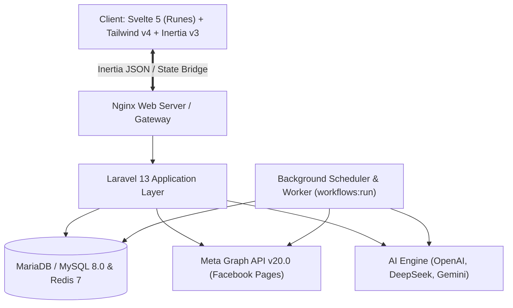

# Autoffiliate (AI Affiliate Platform)

A modern, full-stack automated affiliate marketing management and content generation studio built with **Laravel 13**, **Svelte 5**, **Inertia.js v3**, **Tailwind CSS v4**, and **Vite 8**.

---

## ⚡ Tech Stack

- **Backend:** Laravel 13 (PHP 8.3+), Laravel Fortify, Inertia.js (Laravel adapter v3), Wayfinder
- **Frontend:** Svelte 5 (Runes), Inertia.js (Svelte v3), Tailwind CSS v4, Lucide Icons, Bits UI, Sonner
- **Database & Cache:** MariaDB 11 / MySQL, Redis 7
- **Development Environment:** VS Code Dev Containers / Docker Compose

---

## 🏛️ System Architecture

Detailed architecture, database ERD, and execution sequence diagrams are documented in [`docs/ARCHITECTURE.md`](docs/ARCHITECTURE.md).



---

## 🔑 Default Credentials & Access

### 1. Default Web UI Admin Credentials
- **Username / Email:** `admin` or `admin@example.com`
- **Password:** `admin123`
*(Alternative Seeded Account: `test@example.com` / `password`)*

### 2. Database (MariaDB / MySQL)
- **Host / Port:** `127.0.0.1:3306` (or `db:3306` inside Dev Container)
- **Database Name:** `laravel` (or `autoaff` in docker-compose)
- **User:** `laravel` or `root`
- **Password:** `example`

### 3. Adminer (Database GUI)
- **URL:** `http://localhost:8080`
- **System:** MySQL / MariaDB
- **Server:** `db`
- **Username:** `laravel` / `root`
- **Password:** `example`
- **Database:** `autoaff`

---

## 🛠️ CLI Commands & User Management

### Create New Users via CLI
Create administrative or team user accounts directly from the terminal without registering through the UI:

```bash
# Interactive mode (prompts for Name, Email, and Password)
php artisan make:user
# or alias:
php artisan user:create

# Direct command with arguments
php artisan make:user admin@example.com "Admin User" --password="YourSecurePassword"
```

---

## 🌐 Facebook Page Integration & Long-Lived Access Tokens

To publish posts automatically and handle fan comment auto-replies, you need a **Never-Expiring Long-Lived Page Access Token**.


### 1. Prerequisites (Meta Developer App)
1. Go to [developers.facebook.com/apps](https://developers.facebook.com/apps) and create/select your App (Type: **Business** or **Other**).
2. Go to **App Settings ➔ Basic** and note down your **App ID** and **App Secret**.

### 2. Generate Short-Lived User Token
1. Open the [Meta Graph API Explorer](https://developers.facebook.com/tools/explorer).
2. In the top-right **Meta App** dropdown, select your App.
3. Under **User or Page**, select **User Token**.
4. In the **Permissions** section, add the following required scopes:
   - `pages_show_list` — List and discover managed pages
   - `pages_read_engagement` — Read post metrics and engagement
   - `pages_manage_posts` — Publish, edit, and delete page posts
   - `pages_read_user_content` — Read comments for auto-reply triggers
5. Click **Generate Access Token** and approve permissions in the popup.
6. Copy the generated User Access Token (`EAAB...`).

### 3. Built-In 1-Click Auto-Exchange in Autoffiliate UI (Recommended)
Instead of manual cURL requests, use the built-in Auto-Exchange tool in the application:
1. Go to **Settings ➔ Connected Social Accounts ➔ Connect Account** (or click **Edit ✏️** on an existing page).
2. Click **"⚡ Auto-Exchange Short-Lived User Token to Permanent Page Token"**.
3. Enter your **App ID**, **App Secret**, and paste your short-lived **User Token** (`EAAB...`).
4. Click **"⚡ Generate & Set Long-Lived Token"**.
   - The app exchanges the token behind the scenes via `POST /settings/token/exchange`.
   - It automatically extracts and populates your **Permanent Page Access Token**, **Page Name**, and **Page ID**!
5. Click **"🔍 Verify Token"** at any time to inspect live expiry status (`Never Expires ♾️`).

---

### 4. Manual Exchange via API / cURL (Alternative)

#### Step A: Exchange for 60-Day Long-Lived User Token
```bash
curl -G "https://graph.facebook.com/v20.0/oauth/access_token" \
  -d "grant_type=fb_exchange_token" \
  -d "client_id=YOUR_APP_ID" \
  -d "client_secret=YOUR_APP_SECRET" \
  -d "fb_exchange_token=YOUR_SHORT_LIVED_USER_TOKEN"
```
*Response contains `access_token` (60-day Long-Lived User Token).*

#### Step B: Retrieve the Permanent Page Access Token
```bash
curl -G "https://graph.facebook.com/v20.0/me/accounts" \
  -d "fields=id,name,access_token" \
  -d "access_token=YOUR_60_DAY_LONG_LIVED_USER_TOKEN"
```
*The `access_token` returned inside each page item in `data[]` is a **Permanent Page Access Token** that never expires.*

### 5. Verify & Debug Token Expiration
```bash
curl -G "https://graph.facebook.com/v20.0/debug_token" \
  -d "input_token=YOUR_PAGE_ACCESS_TOKEN" \
  -d "access_token=YOUR_APP_ID|YOUR_APP_SECRET"
```
*Check the response:*
- `type`: `"PAGE"`
- `is_valid`: `true`
- `expires_at`: `0` (Indicating it will never expire)

### 6. Connect to Autoffiliate
1. Open the web UI and go to **Settings ➔ Social Accounts**.
2. Click **Connect Page / Account**.
3. Select **Facebook**, enter your **Page Name**, numeric **Page ID**, and paste your **Permanent Page Access Token**.
4. Toggle **Enabled** to activate automated publishing.

---

## 🚀 Quick Start & Installation

### Option A: VS Code Dev Container (Recommended)
1. Open the project folder in VS Code.
2. When prompted, click **"Reopen in Container"** (or run `Dev Containers: Reopen in Container` from the Command Palette).
3. The Dev Container automatically runs `post-create.sh` to install Composer and NPM dependencies, prepare `.env`, and generate the application key.
4. Run migrations and seeds:
   ```bash
   php artisan migrate --seed
   ```
5. Start development servers:
   ```bash
   composer run dev
   ```

### Option B: Local Setup
1. **Clone repository & enter directory:**
   ```bash
   git clone <repo-url> autoffiliate
   cd autoffiliate
   ```
2. **Install PHP & Node dependencies:**
   ```bash
   composer install
   npm install
   ```
3. **Configure environment:**
   ```bash
   cp .env.example .env
   php artisan key:generate
   ```
4. **Configure Database in `.env` and run migrations:**
   ```bash
   php artisan migrate --seed
   ```
5. **Start Dev Server (Laravel + Vite):**
   ```bash
   composer run dev
   ```
   *Application will be available at `http://localhost:8000` (and Vite HMR at `http://localhost:5173`).*

---

## 📁 Key Project Structure

```
├── app/
│   ├── Console/Commands/       # Custom Artisan commands (e.g. CreateUserCommand)
│   ├── Http/Controllers/       # PostController, SettingsController, WorkflowController
│   ├── Models/                 # User, Post, Setting, SocialAccount, WorkflowRule
│   └── Providers/              # App service providers
├── config/                     # Application configurations
├── database/
│   ├── factories/              # Model factories (UserFactory)
│   ├── migrations/             # Database schemas
│   └── seeders/                # DatabaseSeeder, WorkflowRuleSeeder
├── resources/
│   ├── js/
│   │   ├── components/         # Reusable Svelte 5 UI components
│   │   ├── layouts/            # Page layouts
│   │   ├── pages/              # Inertia Svelte pages (Dashboard, Create, Drafts, Settings)
│   │   └── app.ts              # Frontend entry point
│   └── css/                    # Tailwind CSS styles
├── routes/
│   ├── web.php                 # Web & Inertia routes
│   └── console.php             # Console routes
└── .devcontainer/              # Docker & Dev Container configurations
```

---

## 📜 Available Scripts

| Command | Description |
|---|---|
| `composer run dev` | Runs both Laravel backend (`php artisan serve`) and Vite frontend concurrently |
| `npm run build` | Builds frontend assets for production |
| `npm run lint` / `npm run lint:check` | Runs ESLint and formatting checks |
| `npm run types:check` | Checks TypeScript and Svelte types |
| `composer run lint` | Runs Laravel Pint code style fixer |
| `composer run test` | Runs Pest / PHPUnit test suite |

---

## 🚀 Post Actions & Lifecycle

| Action / Route | Method | Description |
|---|---|---|
| `/drafts` | `GET` | List pending post drafts |
| `/drafts` | `POST` | Create a new affiliate product draft |
| `/posts/custom` | `POST` | Create a custom post draft (community poll, announcement, etc.) |
| `/drafts/{id}` | `PATCH` | Update post details, caption, tags, and media |
| `/drafts/{id}/approve` | `POST` | Mark post draft as approved |
| `/drafts/{id}/generate-caption` | `POST` | Generate/regenerate AI captions (`viral`, `taglish`, `specs`, `standard`) |
| `/drafts/{id}/publish` | `POST` | Publish to connected Facebook Page(s) and dispatch n8n webhook |
| `/drafts/{id}` | `DELETE` | Delete post draft |
| `/history` | `GET` | View published and approved post history |
| `/settings/social-accounts/{id}/test-post` | `POST` | Send an instant 1-click live test post to the specific connected page |

---

## ⚡ Automated & Scheduled Workflows (`/automated`)

The **Automated Posting & Workflow Studio** provides 3 execution tabs:

1. **Scheduled Rules**:
   - Multi-step modal wizard for creating rules (Preset Templates, Time Slots, Intervals, Days, Action Step Pipelines, Tones, Creator Personas, Custom Voice, Weather & Occasion Awareness, and Live Dynamic Time Greetings).
   - Live Countdown ticker showing real-time execution countdowns.
   - Run Now, Edit, Toggle Active/Paused, Delete, and Post Preview.
2. **Event Triggers (Webhooks / Price Drops)**:
   - Price Drop Watcher (>30% OFF), Inbound Telegram Webhooks, Facebook Page Comment Keyword Auto-Replies ("HM", "LINK"), and n8n Outbound Webhooks.
   - Live sample payload inspection and integration setup instructions.
3. **Execution Logs**:
   - Real-time filtered logs by Type (`scheduled`, `event`, `manual`), Status (`SUCCESS`, `FAILED`, `RUNNING`), and Search Query.
   - Direct link to view live published posts on Facebook.

### Key Workflow Routes:
- `GET /automated` — Render Automated Workflow Studio
- `POST /automated` / `POST /api/workflows/rules` — Save / update workflow rules
- `POST /automated/execute` / `POST /api/workflows/execute` — Execute multi-action workflow pipeline server-side
- `POST /automated/{id}/toggle` / `PUT /api/workflows/rules/{id}/status` — Toggle active / disabled status
- `DELETE /automated/{id}` / `DELETE /api/workflows/rules/{id}` — Delete workflow rule

---

## 🤖 AI Usage Logs, Token Stats & Analytics

Autoffiliate tracks token usage and estimated API cost per generation:

- **Database Table:** `ai_usage_logs` (`id`, `timestamp`, `post_id`, `provider`, `model`, `style`, `prompt_tokens`, `completion_tokens`, `total_tokens`, `estimated_cost`).
- **Dashboard Stats:**
  - Total Generations (runs)
  - Total Tokens Used (prompt vs completion breakdown)
  - Estimated Cumulative Cost ($ USD)
  - Active AI Provider & Model (DeepSeek, OpenAI, Gemini)
  - Usage Breakdown by Provider & Caption Tone Preset
  - Recent AI Generation Activity Feed
- **Analytics Endpoint:** `GET /api/analytics/ai`

---

## 🔒 Sensitive Data & Credentials Storage

| Category | Storage Location | Notes |
|---|---|---|
| **AI Keys & Model Config** | Database `settings` table | Keys: `ai_api_key`, `ai_provider`, `ai_model`, `ai_system_prompt` |
| **Facebook Graph API** | Database `settings` & `social_accounts` tables | Keys: `fb_app_id`, `fb_app_secret`, `fb_page_id`, `fb_page_token`, and per-page tokens |
| **n8n Webhook Secret** | Database `settings` table | Keys: `n8n_outbound_webhook`, `webhook_secret` |
| **Environment Fallbacks** | `.env` | `APP_KEY`, `DB_PASSWORD`, `REDIS_PASSWORD` |
| **UI Masking** | Frontend `Settings/Index.svelte` | All secrets masked (`••••••••`) by default |

---

## 📝 Caption & Tag Formatting Standards

To ensure optimal engagement, clean community presentation, and regulatory affiliate compliance across Facebook and social channels, posts follow these rules:

1. **Post Body**: Dynamic time/weather hook + engagement questions or product selling points + emojis.
2. **Conditional Affiliate Disclosure**: `"Affiliate link. Price and availability may change anytime."` is **ONLY included if the post actually contains an affiliate link** (Shopee, Lazada, etc.). Clean community greetings, discussions, or general announcements will **not** include the disclaimer.
3. **Hashtags / Tags**: Always placed at the **VERY END** (`#TechSulitDeals #ShopeePH #automated`).

```text
[Caption Body & Engaging Question / Hook]

[Affiliate Disclosure (Only if affiliate link is present)]

[Hashtags / Tags at the VERY END]
```

---

## 🎨 UI & Action Button Standards

- **Action Buttons:** Standard, non-fancy, compact 28x28px (`w-7 h-7`) outline SVG icon buttons across all cards and tables (Edit pencil, Delete trash, Run triangle/spinner, Toggle power ring).
- **Icons & Badges:** Subtle color-coded pill indicators (Emerald for active/published, Indigo for scheduled/approved, Amber for warning/draft, Red for failed/delete).

---

## ⚙️ Background Scheduling & Worker Pipeline

Automated postings trigger seamlessly 24/7 even when no browser tabs are open:

1. **Artisan Scheduler Command:** `php artisan workflows:run`
   - Evaluates active rules in `Asia/Manila` time (`UTC+8`) against days, times, and execution intervals.
   - Accepts `--force` flag for immediate test runs.
2. **Queued Background Job:** [`ExecuteWorkflowRuleJob`](file:///home/war/projects/autoffiliate/app/Jobs/ExecuteWorkflowRuleJob.php)
   - Dispatched asynchronously to execute the pipeline, log AI tokens, create draft records, and publish to Facebook Graph API.
3. **Laravel Scheduler Registration:** Registered in [`routes/console.php`](file:///home/war/projects/autoffiliate/routes/console.php) to run `everyMinute()`.
4. **Development Runner:** `composer run dev` runs `PHP`, `VITE`, and `SCHEDULER` (`php artisan schedule:work`) concurrently.

---

## 🚀 GitHub Actions CI/CD & Deployment

- **Unified CI/CD Workflow ([`.github/workflows/ci-cd.yml`](.github/workflows/ci-cd.yml)):**
  - **Job 1 (Quality Checks & Tests):** Runs on every pull request and push to `main`. Sets up PHP 8.3 & Node 20, verifies TypeScript/Svelte types, checks ESLint, compiles Vite assets, and runs SQLite test suite.
  - **Job 2 (Hostinger SSH Deployment):** Triggers automatically on push to `main` when `HOSTINGER_SSH_HOST` secret is present. Connects via SSH, runs zero-downtime deployment (`git pull`, `composer install --no-dev`, `php artisan migrate`, cache optimization).
- **Dedicated Deployment Guide:** Detailed Hostinger VPS & hPanel setup available in [`docs/HOSTINGER_DEPLOYMENT.md`](docs/HOSTINGER_DEPLOYMENT.md), [`docs/GITHUB_ACTIONS_DEPLOYMENT.md`](docs/GITHUB_ACTIONS_DEPLOYMENT.md), and [`/home/war/vault/hostinger-cicd-setup.md`](/home/war/vault/hostinger-cicd-setup.md).

