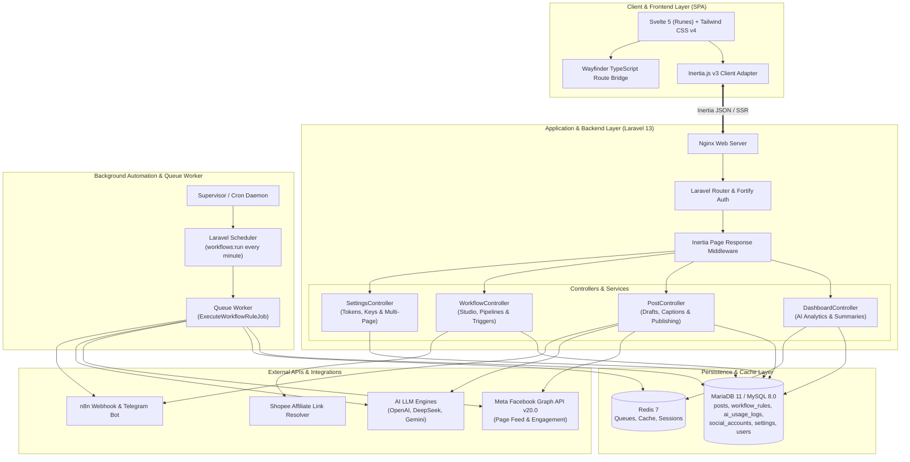
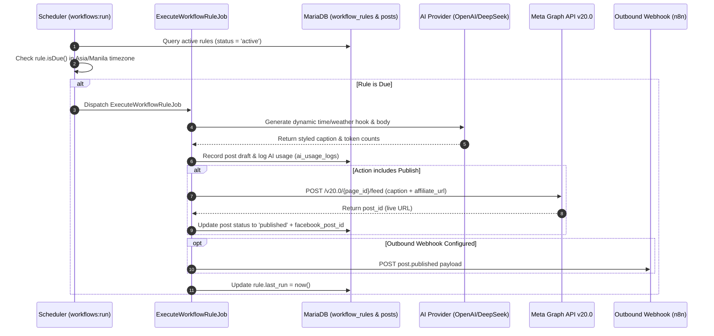
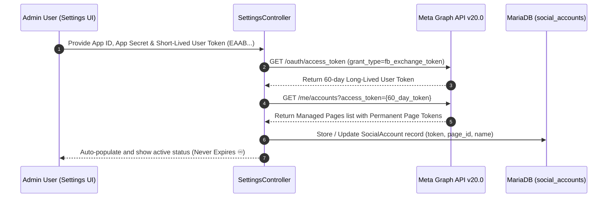
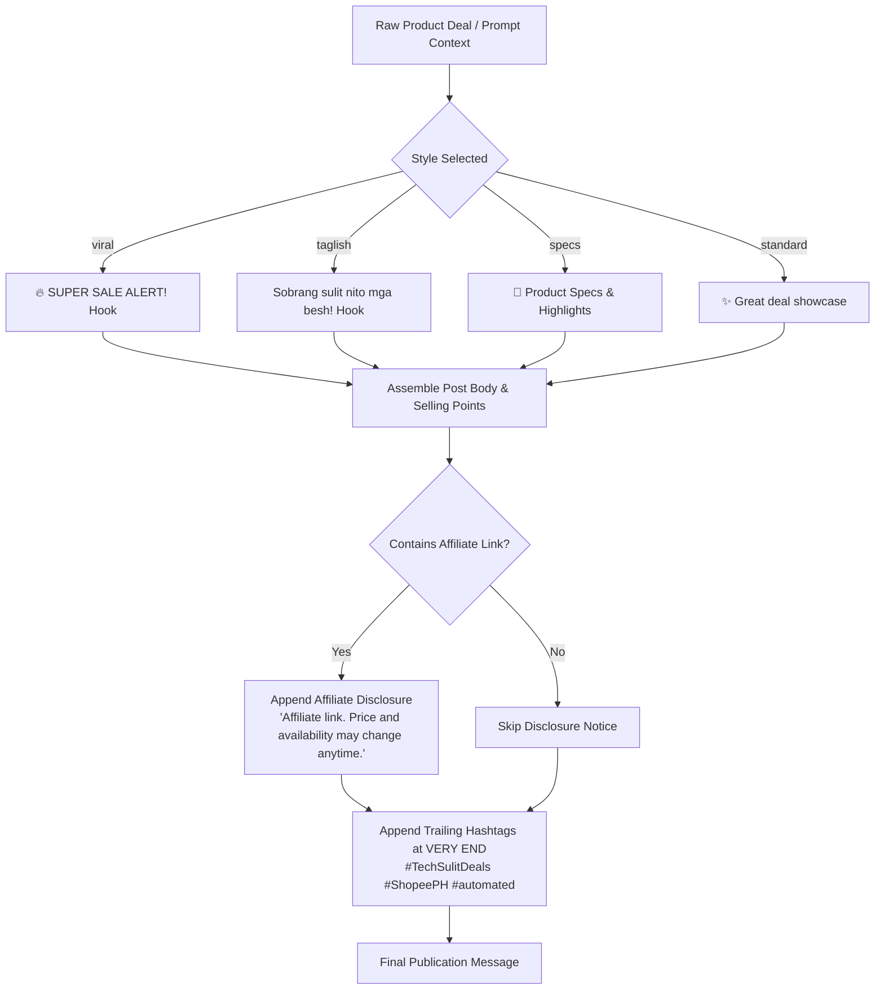
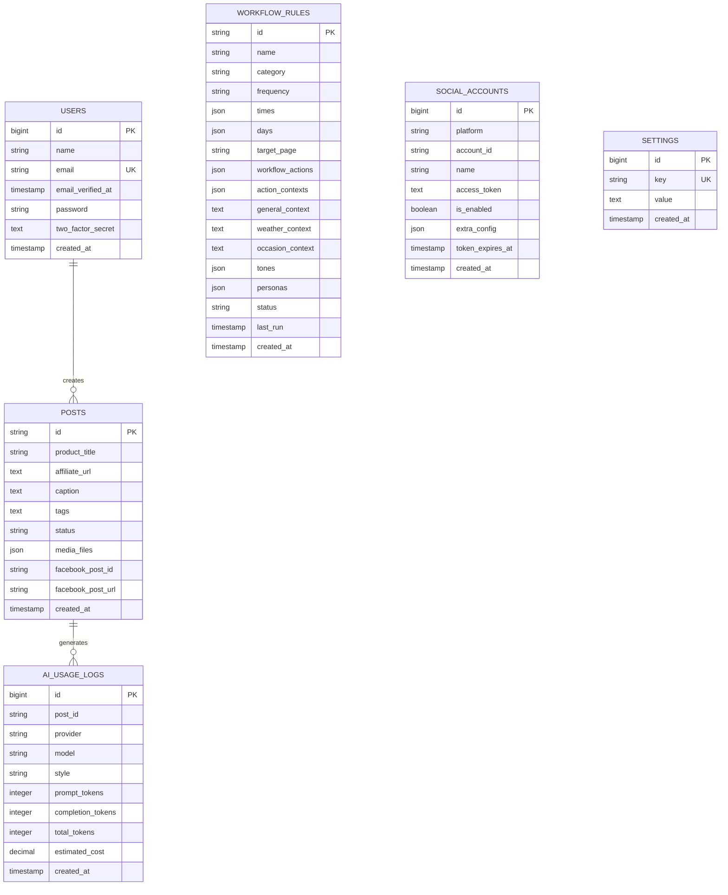

# Autoffiliate - System Architecture & Design

This document details the architectural design, component interactions, data models, and execution pipelines of the **Autoffiliate** platform.

---

## 🏛️ High-Level System Architecture

---

## 🔄 Core Data & Execution Flows

### 1. Automated Workflow Execution Flow

---

### 2. Facebook Permanent Page Token Exchange Flow

---

### 3. Caption & Compliance Formatting Pipeline

---

## 🗄️ Database Entity-Relationship Diagram

---

## 🛡️ Security Architecture

1. **Credential Segregation**: AI API keys, Meta App Secrets, and webhook secrets are stored securely in the database `settings` table and never exposed in frontend Inertia props.
2. **UI Masking**: Sensitive fields in the Settings page (`Settings/Index.svelte`) are masked (`••••••••`) by default with client-side toggle controls.
3. **Session & Auth Protection**: Built on Laravel Fortify with 2FA support, rate-limiting on authentication endpoints, and strict CSRF token validation.
4. **Permanent Token Isolation**: Page Access Tokens are tied to specific Page IDs with explicit minimal scopes (`pages_manage_posts`, `pages_read_engagement`).
