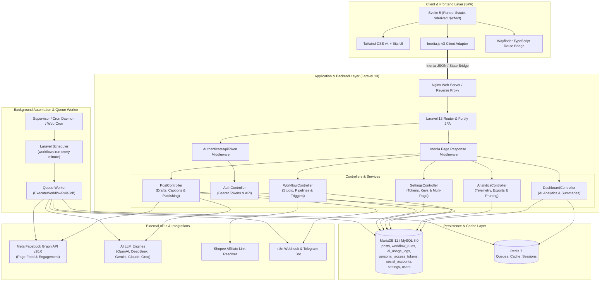
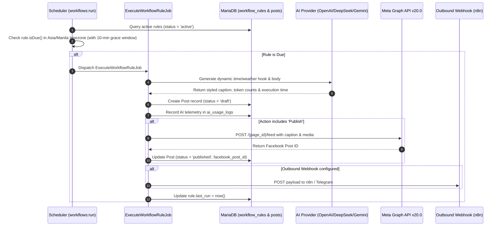
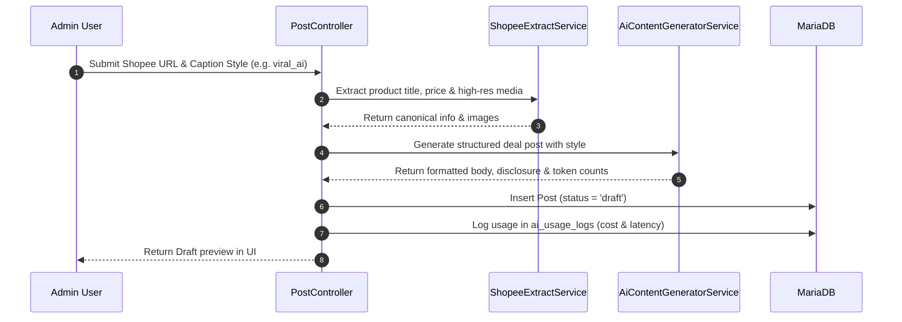
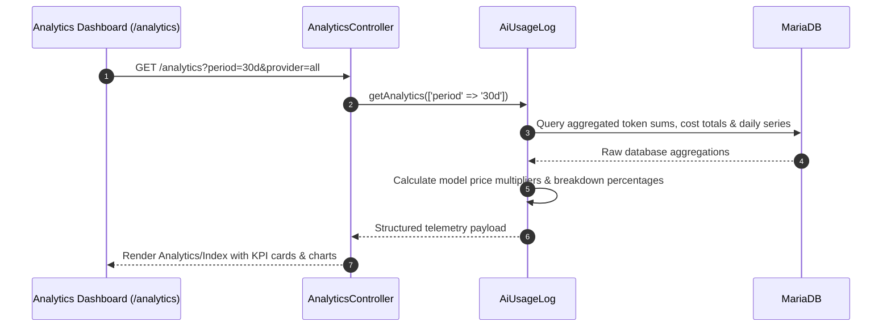

# Autoffiliate - System Architecture & Technical Blueprint

Technical architecture, component interaction contracts, data models, and execution pipelines of the **Autoffiliate** platform.

---

## 🏛️ High-Level System Architecture

---

## 🔄 Core Data & Execution Flows

### 1. Automated Workflow Execution Flow

### 2. Shopee Deal Creation & AI Caption Pipeline

### 3. AI Token Telemetry & Analytics Pipeline

---

## 🧩 Component Responsibilities

| Component | Class / File | Primary Responsibility |
|---|---|---|
| **AI Generator** | [`AiContentGeneratorService`](../app/Services/AiContentGeneratorService.php) | Connects to OpenAI, DeepSeek, Gemini, Claude, Groq, and fallback template engine; tracks latency. |
| **Telemetry Logger** | [`AiUsageLog`](../app/Models/AiUsageLog.php) | Persists token metrics, applies accurate model pricing rates, and computes analytics breakdowns. |
| **Analytics Controller** | [`AnalyticsController`](../app/Http/Controllers/AnalyticsController.php) | Renders analytics UI, exports CSV/JSON reports, and manages log pruning. |
| **Product Extractor** | [`ShopeeExtractService`](../app/Services/ShopeeExtractService.php) | Unshortens Shopee links, extracts media carousels, and formats prices. |
| **Workflow Engine** | [`WorkflowController`](../app/Http/Controllers/WorkflowController.php) & [`ExecuteWorkflowRuleJob`](../app/Jobs/ExecuteWorkflowRuleJob.php) | Schedules, triggers, and executes autonomous syndication rules. |
| **API Auth Middleware** | [`AuthenticateApiToken`](../app/Http/Middleware/AuthenticateApiToken.php) | Authenticates API requests via Bearer token or X-API-Key header. |
