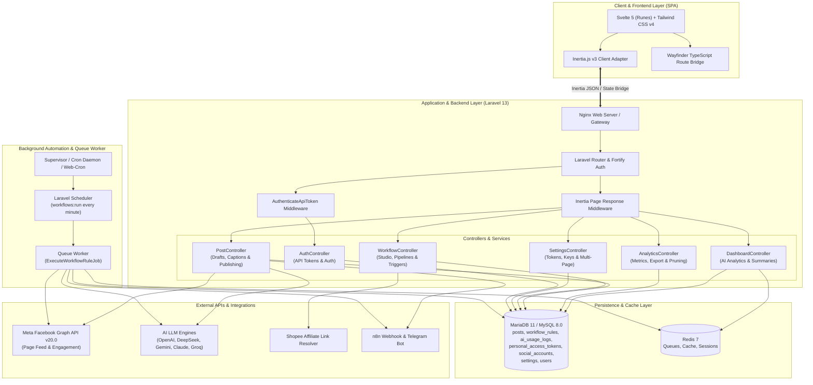
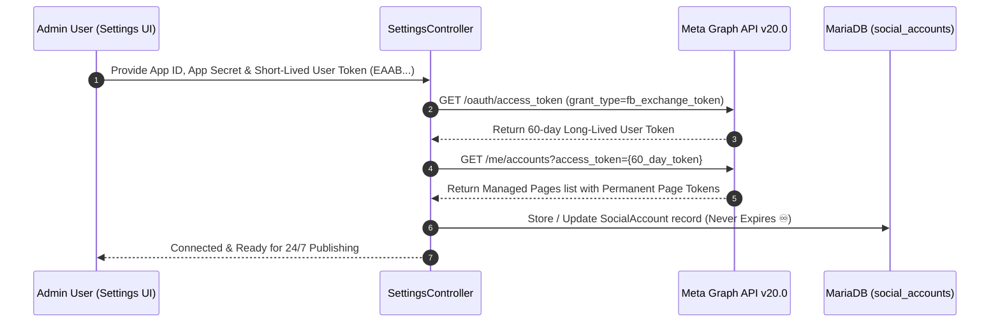
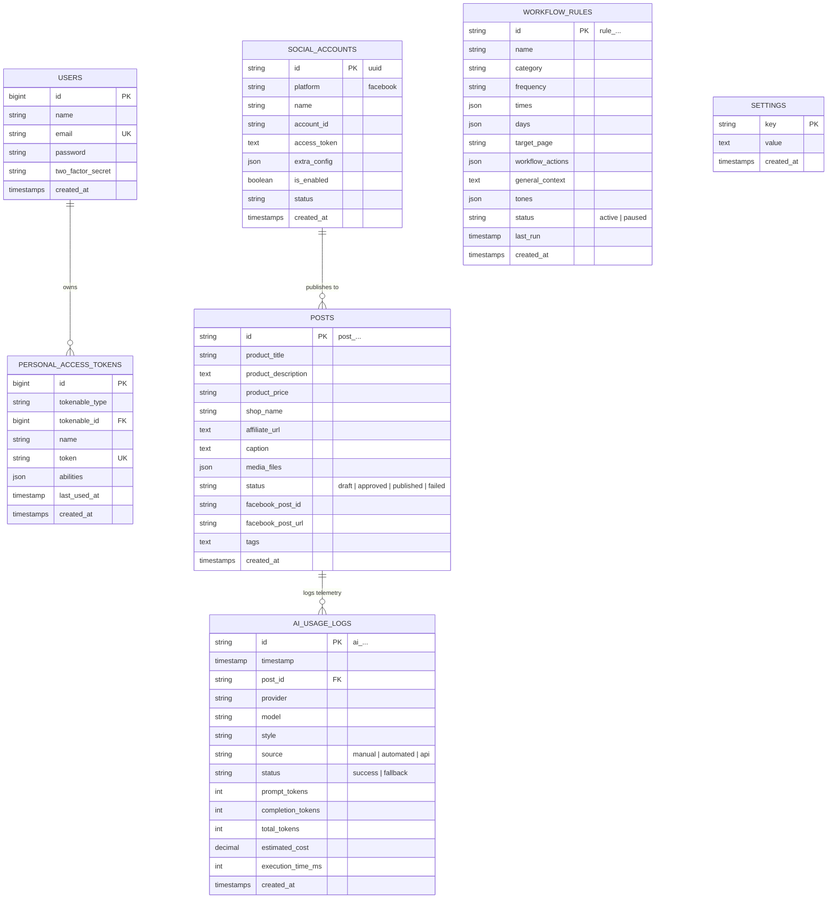

# Autoffiliate — Master Operations, Architecture & Deployment Documentation

Comprehensive guide and architectural blueprint for the **Autoffiliate** platform — an AI-powered affiliate marketing studio, automated social media syndication system, and API suite built with **Laravel 13**, **Svelte 5 (Runes)**, **Inertia.js v3**, **Tailwind CSS v4**, and **Vite 8**.

---

## 📑 Table of Contents

1. [Executive Overview & Tech Stack](#-executive-overview--tech-stack)
2. [System Architecture & Component Blueprint](#-system-architecture--component-blueprint)
3. [AI Telemetry, Token Tracking & Cost Analytics](#-ai-telemetry-token-tracking--cost-analytics)
4. [Background Automation & Workflow Engine](#-background-automation--workflow-engine)
5. [Token-Based REST API Suite](#-token-based-rest-api-suite)
6. [Facebook Graph API & Multi-Page Management](#-facebook-graph-api--multi-page-management)
7. [Shopee PH Deal Extraction & Media Pipeline](#-shopee-ph-deal-extraction--media-pipeline)
8. [CI/CD Pipeline: Build with Node ➔ Deploy via SSH](#-cicd-pipeline-build-with-node--deploy-via-ssh)
9. [Hostinger Deployment Guide](#-hostinger-deployment-guide)
10. [Database Entity-Relationship Model](#-database-entity-relationship-model)
11. [Security, Authentication & Credential Management](#-security-authentication--credential-management)

---

## ⚡ Executive Overview & Tech Stack

Autoffiliate streamlines automated deal hunting, dynamic AI copywriting, token analytics, and multi-channel publication (Facebook Pages, Webhooks, Telegram).

```text
┌────────────────────────────────────────────────────────────────────────┐
│                          AUTOFFILIATE STUDIO                           │
├──────────────────────────┬─────────────────────────────────────────────┤
│ Frontend Framework       │ Svelte 5 (Runes: $state, $derived, $effect) │
│ State & Navigation       │ Inertia.js v3 (Svelte adapter) + Wayfinder  │
│ UI & Design System       │ Tailwind CSS v4, Bits UI, Lucide Svelte     │
│ Backend Framework        │ Laravel 13 (PHP 8.3+) with Fortify (2FA)    │
│ Background Queue & Cache │ Redis 7 + Laravel Queued Jobs               │
│ Database Persistence     │ MariaDB 11 / MySQL 8.0                      │
│ AI Intelligence Engines  │ OpenAI, DeepSeek, Google Gemini, Anthropic  │
│ Telemetry & Analytics    │ Token usage, model latency, USD cost audit  │
│ Social Media Publishing  │ Meta Facebook Graph API v20.0               │
│ API Authentication       │ Personal Access Tokens (Sanctum/Bearer)     │
│ Task Automation Daemon   │ Supervisor / Laravel Scheduler / Web-Cron   │
└──────────────────────────┴─────────────────────────────────────────────┘
```

---

## 🏛️ System Architecture & Component Blueprint

### High-Level Component Architecture



---

## 🤖 AI Telemetry, Token Tracking & Cost Analytics

The AI Analytics engine logs every AI prompt generation, completion token, USD cost, latency in milliseconds, and entry source.

### 1. Telemetry Data Model (`ai_usage_logs`)
- `id`: Unique random string (`ai_...`)
- `timestamp`: Execution datetime (`Asia/Manila` timezone)
- `post_id`: Associated post record ID (nullable)
- `provider`: `openai`, `deepseek`, `gemini`, `anthropic`, `groq`, `openrouter`, or `internal`
- `model`: Model name (e.g. `gpt-4o-mini`, `deepseek-chat`, `gemini-1.5-flash`)
- `style`: Caption tone (`viral_ai`, `pinoy_taglish`, `specs_tech`, `urgency_flash`, `aesthetic`, `minimal`)
- `source`: Trigger origin (`manual_draft`, `regenerate`, `automated_workflow`, `api_endpoint`)
- `prompt_tokens`: Token count of the input context & user instructions
- `completion_tokens`: Token count of the generated response
- `total_tokens`: Sum of prompt and completion tokens
- `estimated_cost`: Cumulative cost calculated in USD
- `execution_time_ms`: API latency in milliseconds
- `status`: Execution outcome (`success`, `fallback`)

### 2. Live Pricing Calculation Engine

| Provider | Model | Prompt Tokens (per 1M) | Completion Tokens (per 1M) |
|---|---|---|---|
| **OpenAI** | `gpt-4o-mini` | $0.15 | $0.60 |
| **OpenAI** | `gpt-4o` | $2.50 | $10.00 |
| **OpenAI** | `o1` / `o3-mini` | $1.10 | $4.40 |
| **DeepSeek** | `deepseek-chat` (V3) | $0.14 | $0.28 |
| **DeepSeek** | `deepseek-reasoner` (R1) | $0.55 | $2.19 |
| **Google Gemini** | `gemini-1.5-flash` / `gemini-2.0-flash` | $0.075 | $0.30 |
| **Google Gemini** | `gemini-1.5-pro` / `gemini-2.0-pro` | $1.25 | $5.00 |
| **Anthropic** | `claude-3-5-sonnet` | $3.00 | $15.00 |
| **Anthropic** | `claude-3-5-haiku` | $0.80 | $4.00 |
| **Groq** | `llama-3.3-70b` | $0.59 | $0.79 |
| **Groq** | `llama-3.1-8b` | $0.05 | $0.08 |
| **Dynamic Engine** | `dynamic-engine` (Fallback) | $0.00 | $0.00 |

### 3. Analytics User Interface (`/analytics`)
- **Period Filter:** `Today`, `7 Days`, `30 Days`, `90 Days`, `All Time`.
- **KPI Summary Cards:** Total Generations, Input/Output Token Ratio, Total Spend ($), Active Model & Avg Latency.
- **Daily Volume Bar Chart:** Visual token activity and cost trend over the selected period.
- **Distribution Breakdowns:** Usage by AI Provider, Model, Caption Style, and Source.
- **Searchable Audit Table:** Real-time search across post titles, models, and timestamps with direct links to edit drafts.
- **Data Export:** Instant CSV and JSON downloadable reports.
- **Log Pruning:** Configurable retention policy (delete records older than 30, 60, 90 days or full reset).

---

## ⚙️ Background Automation & Workflow Engine

Automated publishing executes seamlessly 24/7 in the background without requiring active browser sessions:

1. **Artisan Command:** `php artisan workflows:run`
   - Evaluates active rules in Philippine Time (`Asia/Manila`, `UTC+8`).
   - Checks matching weekdays, weekends, specific days (`Mon`, `Tue`), and time slots (`08:00 AM`, `13:00`).
   - Features a **10-minute grace period window** for shared hosting environments (Hostinger) where cron triggers might experience brief server delays.
   - Enforces a 2-minute debounce window via `last_run` timestamp.
2. **Queued Asynchronous Job:** [`ExecuteWorkflowRuleJob`](../app/Jobs/ExecuteWorkflowRuleJob.php)
   - Evaluates dynamic context (time-of-day greetings, weather, occasions).
   - Generates AI captions and logs token telemetry to `ai_usage_logs`.
   - Creates post records and publishes to the Meta Graph API.
   - Dispatches outbound webhooks (e.g. n8n).
3. **Web-Cron Remote Trigger:** `GET /api/cron/workflows?token=<SECRET>`
   - Enables Hostinger web-cron pings or external uptime services to trigger the automation runner over HTTPS.

---

## 🔐 Token-Based REST API Suite

Autoffiliate includes a complete Bearer token authentication system for third-party automation tools (n8n, Make, Telegram bots, iOS Shortcuts, CLI scripts):

### Authentication Middleware
Pass your token via standard HTTP headers:
- `Authorization: Bearer <API_TOKEN>`
- `X-API-Key: <API_TOKEN>`

### Core API Endpoints

| Method | Endpoint | Description |
|---|---|---|
| `POST` | `/api/auth/login` | Authenticate and obtain personal access token |
| `GET` | `/api/auth/tokens` | List active named API keys and last used dates |
| `POST` | `/api/auth/tokens` | Generate new permanent named API key |
| `DELETE` | `/api/auth/tokens/{id}` | Revoke an API key immediately |
| `POST` | `/api/extract` | Extract product details & media from Shopee URL |
| `GET` | `/api/posts` | List recent posts and drafts with pagination |
| `POST` | `/api/posts` | Create new post draft from affiliate link |
| `POST` | `/api/draft/generate` | Generate AI caption with style and track tokens |
| `POST` | `/api/publish` | Publish post to connected Facebook page |
| `GET` | `/api/analytics/ai` | Fetch JSON AI token analytics and breakdowns |
| `GET` | `/api/analytics/ai/export` | Download CSV/JSON analytics report |
| `POST` | `/api/analytics/ai/clear` | Prune or reset telemetry logs |

---

## 🔑 Facebook Graph API & Multi-Page Management

### Permanent Page Access Token Exchange Flow

To eliminate the need for monthly token refreshes, Autoffiliate features a **1-Click Permanent Token Generator**:



### Caption & Tag Formatting Pipeline
All generated posts adhere to strict compliance guidelines:

```text
┌─────────────────────────────────────────────────────────────┐
│ [Dynamic Hook / Time Greeting / Selling Points Body]        │
│                                                             │
│ 🛒 Order / Buy Link: https://shopee.ph/product-link         │
│                                                             │
│ Affiliate link. Price and availability may change anytime.  │
│                                                             │
│ #TechSulitDeals #ShopeePH #BudolFinds                       │
└─────────────────────────────────────────────────────────────┘
```

---

## 🛍️ Shopee PH Deal Extraction & Media Pipeline

[`ShopeeExtractService`](../app/Services/ShopeeExtractService.php) automatically extracts product metadata from standard or shortened Shopee PH URLs (`shopee.ph/...` or `ph.shp.ee/...`):
- Resolves HTTP 301/302 short link redirects to canonical product URLs.
- Extracts `itemid` and `shopid` identifiers.
- Fetches official Shopee Open Graph and product image carousels.
- Formats Philippine Peso prices (`₱1,299`).

---

## 🚀 CI/CD Pipeline: Build with Node ➔ Deploy via SSH

The automated pipeline ([`.github/workflows/ci-cd.yml`](../.github/workflows/ci-cd.yml)) compiles frontend assets with Node 20 on GitHub's cloud runners and deploys to Hostinger over SSH.

### Required GitHub Secrets / Variables

Configure in **Settings ➔ Secrets and variables ➔ Actions**:

| Name | Type | Example | Description |
|---|---|---|---|
| `HOSTINGER_SSH_HOST` | Secret / Variable | `185.199.108.153` | Server IP or Hostname |
| `HOSTINGER_SSH_USER` | Secret / Variable | `u123456789` | SSH Username (`root` on VPS) |
| `HOSTINGER_SSH_PORT` | Secret / Variable | `65002` | SSH Port (`65002` on hPanel, `22` on VPS) |
| `HOSTINGER_SSH_PASSWORD` | **Secret** | `YourPassword` | SSH Password (or use SSH Key) |
| `HOSTINGER_SSH_KEY` | **Secret** | `-----BEGIN OPENSSH...` | Private SSH Key (optional) |
| `HOSTINGER_APP_PATH` | Secret / Variable | `/home/u123456789/domains/yourdomain.com/app` | Absolute application directory path |

### Pipeline Workflow Execution


---

## 🌐 Hostinger Deployment Guide

### Option 1: Hostinger Shared / Cloud Hosting (hPanel)

1. **PHP Configuration:** In hPanel, navigate to **Advanced ➔ PHP Configuration** and select **PHP 8.3** with `curl`, `fileinfo`, `mbstring`, `openssl`, `pdo_mysql`, `zip`, `bcmath`.
2. **Document Root:** Set web root directory to `/public_html/public` (or symlink `public` to `public_html`).
3. **Database:** Create a MySQL database and user in **Databases ➔ Management**.
4. **Deploy via Git / SSH:**
   ```bash
   ssh -p 65002 u123456789@YOUR_SERVER_IP
   cd ~/domains/yourdomain.com
   git clone https://github.com/warr-dev/autoffiliate.git app
   cd app
   composer install --no-dev --optimize-autoloader
   cp .env.example .env
   # Configure DB details in .env
   php artisan key:generate
   php artisan migrate --force
   ```
5. **Cron Job Setup:**
   In **Advanced ➔ Cron Jobs**, add:
   ```bash
   * * * * * cd /home/u123456789/domains/yourdomain.com/app && php artisan schedule:run >> /dev/null 2>&1
   ```
   Or configure a 1-minute Web-Cron ping hitting:
   ```
   https://yourdomain.com/api/cron/workflows?token=YOUR_CRON_SECRET
   ```

---

## 🗄️ Database Entity-Relationship Model



---

## 🛡️ Security, Authentication & Credential Management

1. **Two-Factor Authentication (2FA):** Fortify TOTP authentication with QR codes and recovery keys.
2. **Token Security:** Bearer tokens are hashed with SHA-256 in `personal_access_tokens`.
3. **Webhook Signatures:** Outbound webhooks include signed payloads and optional bearer secrets.
4. **Rate Limiting:** Login endpoints and public API routes enforce standard throttle limits (5 requests/min for login, 60 requests/min for API).
