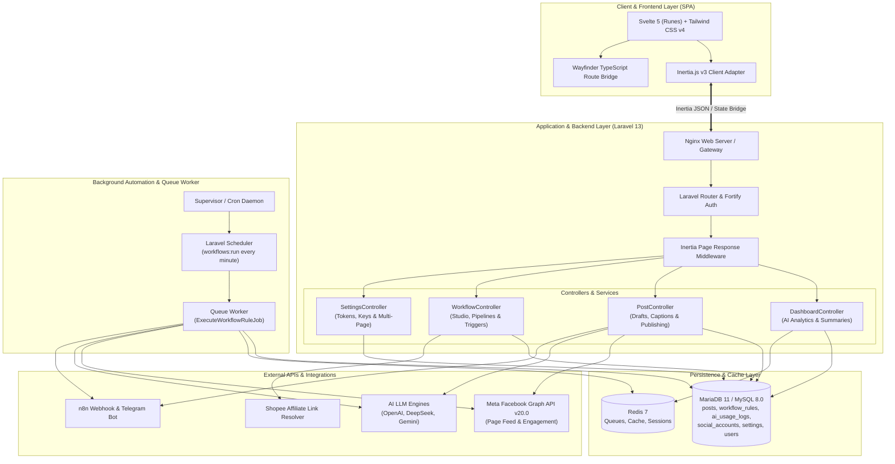
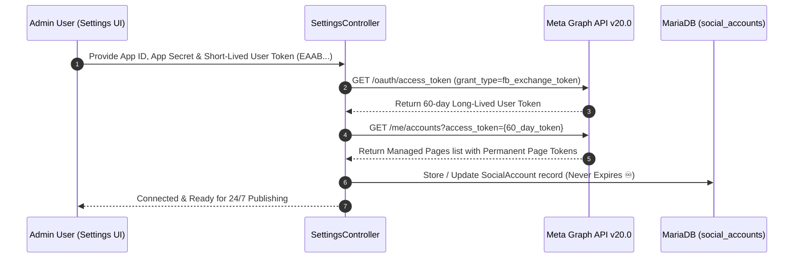
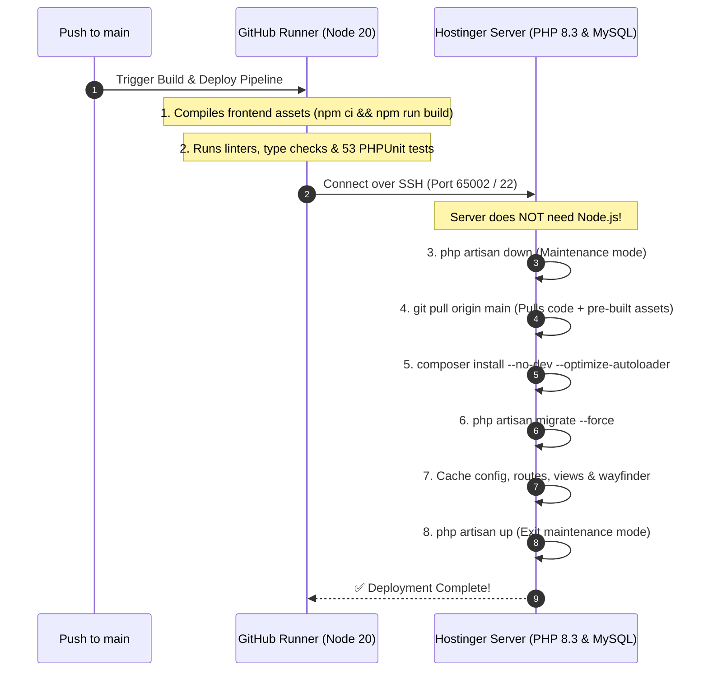
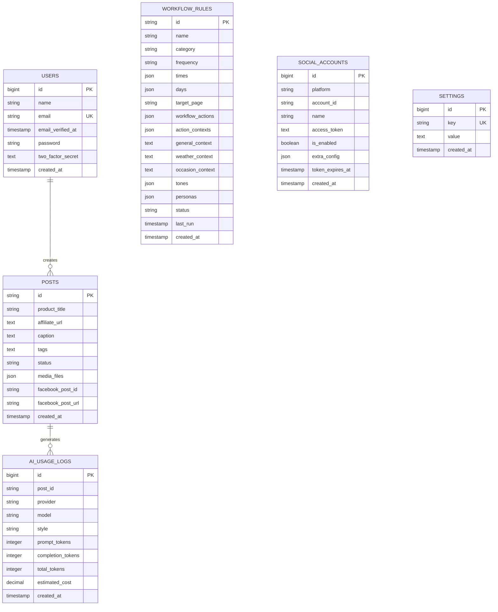

# Autoffiliate — Master Operations, Architecture & Deployment Documentation

Comprehensive guide and architectural blueprint for the **Autoffiliate** platform — an AI-powered affiliate marketing studio and automated social media syndication system built with **Laravel 13**, **Svelte 5 (Runes)**, **Inertia.js v3**, **Tailwind CSS v4**, and **Vite 8**.

---

## 📑 Table of Contents

1. [Executive Overview & Tech Stack](#-executive-overview--tech-stack)
2. [System Architecture & Data Flows](#-system-architecture--data-flows)
3. [Background Automation & Scheduling](#-background-automation--scheduling)
4. [Facebook Graph API & Multi-Page Management](#-facebook-graph-api--multi-page-management)
5. [AI Token Tracking & Cost Analytics](#-ai-token-tracking--cost-analytics)
6. [CI/CD Pipeline: Build with Node ➔ Deploy via SSH](#-cicd-pipeline-build-with-node--deploy-via-ssh)
7. [Hostinger Deployment Guide](#-hostinger-deployment-guide)
8. [CLI Tooling & Quality Assurance](#-cli-tooling--quality-assurance)
9. [Database Entity-Relationship Model](#-database-entity-relationship-model)
10. [Security & Credential Management](#-security--credential-management)

---

## ⚡ Executive Overview & Tech Stack

Autoffiliate streamlines automated deal hunting, dynamic AI content generation, and multi-channel publication (Facebook Pages, Webhooks, Telegram).

```text
┌────────────────────────────────────────────────────────────────────────┐
│                          AUTOFFILIATE STUDIO                           │
├──────────────────────────┬─────────────────────────────────────────────┤
│ Frontend Framework       │ Svelte 5 (Runes: $state, $derived, $effect) │
│ State & Navigation       │ Inertia.js v3 (Svelte adapter) + Wayfinder  │
│ UI & Design System       │ Tailwind CSS v4, Bits UI, Lucide Svelte     │
│ Backend Framework        │ Laravel 13 (PHP 8.3+) with Fortify (2FA)    │
│ Background Queue & Cache │ Redis 7 + Laravel Queued Jobs               │
│ Database Persistence     │ MariaDB 11 / MySQL 8.0                      │
│ AI Intelligence Engines  │ OpenAI (GPT-4o-mini), DeepSeek, Gemini      │
│ Social Media Publishing  │ Meta Facebook Graph API v20.0               │
│ Task Automation Daemon   │ Supervisor / Laravel Scheduler              │
└──────────────────────────┴─────────────────────────────────────────────┘
```

---

## 🏛️ System Architecture & Data Flows

### High-Level Component Architecture



---

## ⚙️ Background Automation & Scheduling

Automated publishing executes seamlessly 24/7 in the background without keeping browser tabs open:

1. **Artisan Scheduler Command:** `php artisan workflows:run`
   - Evaluates active rules in Philippine Time (`Asia/Manila`, `UTC+8`).
   - Checks matching weekdays, weekends, specific days (`Mon`, `Tue`), and time slots (`08:00 AM`, `13:00`).
   - Enforces a 2-minute debounce window via `last_run` timestamp.
2. **Queued Asynchronous Job:** [`ExecuteWorkflowRuleJob`](../app/Jobs/ExecuteWorkflowRuleJob.php)
   - Evaluates dynamic context (time-of-day greetings, weather, occasions).
   - Generates AI captions and logs token usage in `ai_usage_logs`.
   - Creates post records and publishes to the Meta Graph API.
   - Dispatches outbound webhooks (e.g. n8n).
3. **Scheduler Registration:** Scheduled to run every minute in [`routes/console.php`](../routes/console.php):
   ```php
   Schedule::command('workflows:run')->everyMinute();
   ```

---

## 🔑 Facebook Graph API & Multi-Page Management

### Permanent Page Access Token Exchange Flow

To eliminate the need for monthly token refreshes, Autoffiliate features a **1-Click Permanent Token Generator**:



### Caption & Tag Formatting Pipeline
All generated posts adhere to strict compliance guidelines:

```text
┌─────────────────────────────────────────────────────────────┐
│ [Dynamic Hook / Time Greeting / Selling Points Body]        │
│                                                             │
│ Affiliate link. Price and availability may change anytime.  │
│ (Condition: Only appended if affiliate URL is present)      │
│                                                             │
│ #TechSulitDeals #ShopeePH #automated (Trailing Tags at End) │
└─────────────────────────────────────────────────────────────┘
```

---

## 🤖 AI Token Tracking & Cost Analytics

Every AI generation is tracked in the database `ai_usage_logs` table:

- **Metrics Tracked:** `post_id`, `provider` (OpenAI, DeepSeek, Gemini), `model`, `style`, `prompt_tokens`, `completion_tokens`, `total_tokens`, `estimated_cost`.
- **Live Dashboard Stats:**
  - Total AI Generations
  - Cumulative Token Count (Prompt vs Completion)
  - Estimated Total Spend ($ USD)
  - Usage Breakdown by Provider & Tone Preset
  - Real-Time AI Generation Feed

---

## 🚀 CI/CD Pipeline: Build with Node ➔ Deploy via SSH

The automated pipeline ([`.github/workflows/ci-cd.yml`](../.github/workflows/ci-cd.yml)) compiles frontend assets with Node 20 on GitHub's cloud runners and deploys to Hostinger over SSH.

### Required GitHub Secrets / Variables

Configure in **Settings ➔ Secrets and variables ➔ Actions**:

| Name | Type | Example | Description |
|---|---|---|---|
| `HOSTINGER_SSH_HOST` | Secret / Variable | `185.199.108.153` | Server IP or Hostname |
| `HOSTINGER_SSH_USER` | Secret / Variable | `u123456789` | SSH Username (`root` on VPS) |
| `HOSTINGER_SSH_PORT` | Secret / Variable | `65002` | SSH Port (`65002` on hPanel, `22` on VPS) |
| `HOSTINGER_SSH_PASSWORD` | **Secret** | `YourPassword` | SSH Password (or use SSH Key) |
| `HOSTINGER_SSH_KEY` | **Secret** | `-----BEGIN OPENSSH...` | Private SSH Key (optional) |
| `HOSTINGER_APP_PATH` | Secret / Variable | `/home/u123456789/domains/yourdomain.com/app` | Absolute application directory path |

### Pipeline Workflow Execution



---

## 🌐 Hostinger Deployment Guide

### Option 1: Hostinger Shared / Cloud Hosting (hPanel)

1. **PHP Configuration:** In hPanel, navigate to **Advanced ➔ PHP Configuration** and select **PHP 8.3** with `curl`, `fileinfo`, `mbstring`, `openssl`, `pdo_mysql`, `zip`, `bcmath`.
2. **Document Root:** Set web root directory to `/public_html/public` (or symlink `public` to `public_html`).
3. **Database:** Create a MySQL database and user in **Databases ➔ Management**.
4. **Deploy via Git / SSH:**
   ```bash
   ssh -p 65002 u123456789@YOUR_SERVER_IP
   cd ~/domains/yourdomain.com
   git clone https://github.com/warr-dev/autoffiliate.git app
   cd app
   composer install --no-dev --optimize-autoloader
   cp .env.example .env
   # Configure DB details in .env
   php artisan key:generate
   php artisan migrate --seed --force
   php artisan config:cache
   php artisan route:cache
   php artisan view:cache
   ```
5. **hPanel Cron Job Setup:**
   - Go to **Advanced ➔ Cron Jobs** ➔ **Custom**.
   - Schedule: `* * * * *` (Every Minute).
   - Command:
     ```bash
     cd /home/u123456789/domains/yourdomain.com/app && /usr/bin/php artisan schedule:run >> /dev/null 2>&1
     ```

### Option 2: Hostinger VPS (Ubuntu 22.04 / 24.04)

1. **Install Packages:**
   ```bash
   sudo apt update && sudo apt install -y nginx php8.3-fpm php8.3-mysql php8.3-curl php8.3-mbstring php8.3-xml php8.3-zip php8.3-bcmath php8.3-redis mariadb-server redis-server supervisor certbot python3-certbot-nginx
   ```
2. **Supervisor Daemon:**
   Configure `/etc/supervisor/conf.d/autoffiliate-scheduler.conf`:
   ```ini
   [program:autoffiliate-scheduler]
   process_name=%(program_name)s
   command=/usr/bin/php /var/www/autoffiliate/artisan schedule:work
   autostart=true
   autorestart=true
   user=www-data
   redirect_stderr=true
   stdout_logfile=/var/www/autoffiliate/storage/logs/scheduler-supervisor.log
   ```
3. **1-Click Local Deploy Command:**
   ```bash
   npm run deploy
   # or
   composer run deploy
   ```

---

## 🛠️ CLI Tooling & Quality Assurance

Autoffiliate includes automated test and code-quality commands:

| Command | Purpose |
|---|---|
| `composer run dev` | Runs PHP server, Vite, and background Scheduler concurrently |
| `composer run ci:check` | Executes ESLint, Prettier, Svelte-Check, Pint, PHPStan, and Pest |
| `composer run test` | Clears config and executes Pest / PHPUnit test suite |
| `composer run lint` | Auto-fixes PHP code style via Laravel Pint |
| `npm run lint` | Auto-fixes JavaScript/Svelte via ESLint |
| `npm run format` | Auto-formats codebase via Prettier |
| `npm run types:check` | Validates TypeScript & Svelte compiler types |
| `npm run deploy` | Compiles assets and deploys to remote Hostinger via SSH |
| `php artisan workflows:run` | Evaluates and executes scheduled workflow rules immediately |
| `php artisan make:user` | Creates administrative users via interactive CLI |

---

## 🗄️ Database Entity-Relationship Model



---

## 🛡️ Security & Credential Management

1. **Database Key Storage:** API keys and access tokens are stored in the database `settings` and `social_accounts` tables — never hardcoded in client templates.
2. **Frontend Masking:** Secrets in the Settings interface are masked by default (`••••••••`) with client-side visibility toggles.
3. **Authentication & 2FA:** Fortify authentication with brute-force rate-limiting, CSRF token validation, and Passkey / Two-Factor Authentication support.
